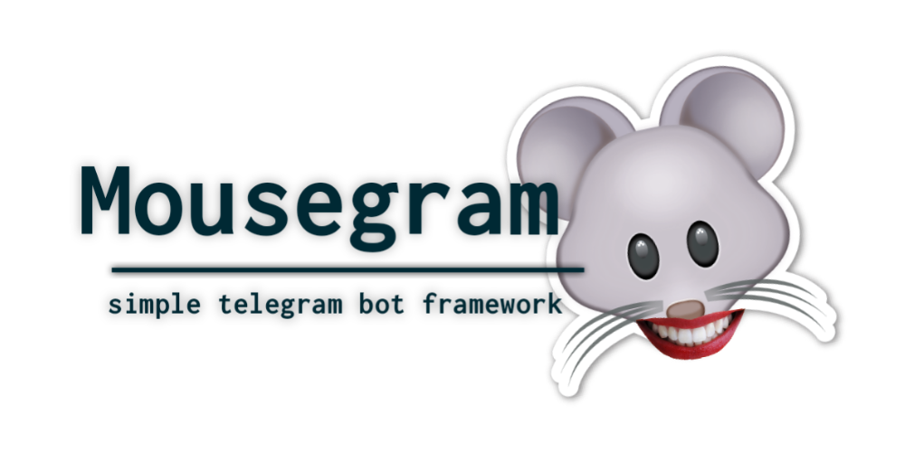

# Welcome


[](https://github.com/callmeumm/mousegram)

**Mousegram use Telegram Bot API v5.3.0** 

### Example
```typescript
import { Mouse, Keyboard, InlineKeyboard } from "mousegram";
const bot = new Mouse('your-token', { polling: true });

const keyboard = new Keyboard() // create keyboard
    .text({ text: 'halo' }) // column 1
    .text({ text: 'halo' }) // column 2
    .row()
    .text({ text: 'halo' }) // row 2 column 1
    
const button = new InlineKeyboard() // create inline keyboard
    .callback({ text: 'iya', callback_data: 'iyacallback' }) // row 1 column 1
    .row()
    .callback({ text: 'tidak', callback_data: 'tidakcallback' }) // row 2 column 1

bot.on('message', (ctx) => {
    if(ctx.text == '/start') {
        bot.method.sendMessage({
            chat_id: ctx.chat.id,
            text: 'Halo',
            reply_markup: keyboard // optional
        })
    } else if(ctx.text == '/keluar') {
        bot.method.sendMessage({
            chat_id: ctx.chat.id,
            text: 'Yakin ingin keluar?',
            reply_markup: button // optional
        })
    }
});

bot.on('callback_query', (ctx) => {
    console.log(ctx);
});
```
### License

MIT

**Please advise if there is an error... this framework is Development**